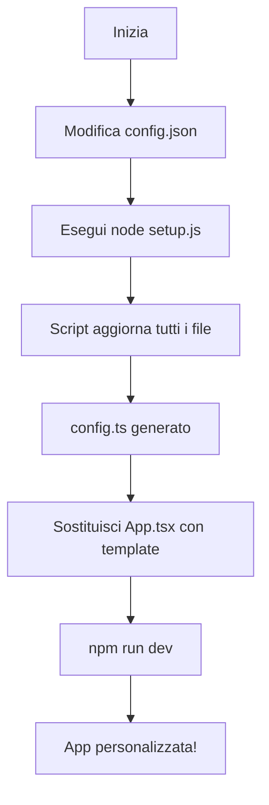

# 🎨 Guida alla Personalizzazione del CRM

Questa guida ti spiega come rendere il tuo CRM OLIO completamente personalizzabile per adattarlo a qualsiasi business.

## 📋 Indice

1. [Quick Start](#quick-start)
2. [Personalizzazione con Script Interattivo](#personalizzazione-con-script-interattivo)
3. [Personalizzazione Manuale](#personalizzazione-manuale)
4. [Struttura dei File](#struttura-dei-file)
5. [Esempi di Configurazione](#esempi-di-configurazione)

---

## 🚀 Quick Start

### Metodo 1: Script Interattivo (Consigliato)

```bash
# 1. Crea una cartella 'config' nella root del progetto
mkdir config
cd config

# 2. Copia i file di configurazione
# - config.json
# - setup.js

# 3. Esegui lo script di setup
node setup.js

# 4. Segui le istruzioni interattive
# 5. Avvia l'app
npm run dev
```

### Metodo 2: Configurazione Rapida

```bash
# Modifica direttamente config/config.json
# Poi esegui:
node config/setup.js
```

---

## 🎯 Personalizzazione con Script Interattivo

Lo script `setup.js` ti guida passo-passo nella personalizzazione:

### Step 1: Nome Applicazione
- **Nome breve**: visualizzato nella sidebar (es: "OLIO", "MyCRM", "GestPro")
- **Nome completo**: titolo della pagina (es: "Olio della Contrada CRM")
- **Descrizione**: sottotitolo (es: "Gestione Business", "Sistema di Gestione")

### Step 2: Palette Colori

Scegli tra 6 preset professionali o personalizza manualmente:

#### Preset Disponibili:

1. **Verde Oliva** (Default)
   - Primario: #4A6D4D
   - Secondario: #D4AF37
   - Ideale per: Agroalimentare, Bio, Naturale

2. **Blu Professionale**
   - Primario: #1E40AF
   - Secondario: #F59E0B
   - Ideale per: Tech, Finanza, Corporate

3. **Rosso Vino**
   - Primario: #7C2D12
   - Secondario: #F59E0B
   - Ideale per: Luxury, Wine, Premium

4. **Grigio Moderno**
   - Primario: #1F2937
   - Secondario: #06B6D4
   - Ideale per: Minimale, Tech, Startup

5. **Viola Tech**
   - Primario: #6366F1
   - Secondario: #EC4899
   - Ideale per: Software, Digital, Creative

6. **Arancio Energia**
   - Primario: #EA580C
   - Secondario: #14B8A6
   - Ideale per: Sport, Energia, Dynamic

### Step 3: Menu
Personalizza le etichette del menu:
- Dashboard → "Pannello di Controllo"
- Clienti → "Customers" / "Anagrafiche"
- Fornitori → "Suppliers" / "Partner"
- Prodotti → "Inventario" / "Catalogo"
- Transazioni → "Vendite" / "Movimenti"

---

## 🔧 Personalizzazione Manuale

### 1. Modifica `config/config.json`

```json
{
  "branding": {
    "appName": "TUO_NOME",
    "appNameLong": "Tuo Nome Completo CRM",
    "appDescription": "La tua descrizione"
  },
  "colors": {
    "primary": {
      "base": "#TUO_COLORE",
      "light": "#TUO_COLORE_CHIARO"
    }
  }
}
```

### 2. Applica le Modifiche

```bash
node config/setup.js
```

Questo aggiornerà automaticamente:
- ✅ `index.html` (title, Tailwind config)
- ✅ `config.ts` (configurazione runtime)
- ✅ `metadata.json` (metadati app)
- ✅ `package.json` (nome package)

---

## 📁 Struttura dei File

```
OLIO/
├── config/
│   ├── config.json          # ← Configurazione principale
│   ├── setup.js             # ← Script di personalizzazione
│   └── README_PERSONALIZZAZIONE.md
├── config.ts                # ← Generato automaticamente
├── App.tsx                  # ← Aggiornare con template
├── index.html               # ← Aggiornato automaticamente
├── metadata.json            # ← Aggiornato automaticamente
└── package.json             # ← Aggiornato automaticamente
```

---

## 🎨 Esempi di Configurazione

### Esempio 1: CRM per Cantina Vinicola

```json
{
  "branding": {
    "appName": "VinoCRM",
    "appNameLong": "Cantina Rossi - Gestione Vendite",
    "appDescription": "Sistema Gestionale Vinicolo"
  },
  "colors": {
    "primary": {
      "base": "#7C2D12",
      "light": "#B91C1C"
    },
    "secondary": {
      "base": "#F59E0B",
      "light": "#FBBF24"
    }
  },
  "menu": {
    "items": [
      { "id": "dashboard", "label": "Panoramica", "icon": "Home" },
      { "id": "customers", "label": "Enoteche", "icon": "UsersIcon" },
      { "id": "products", "label": "Vini", "icon": "Package" },
      { "id": "transactions", "label": "Ordini", "icon": "DollarSign" }
    ]
  }
}
```

### Esempio 2: CRM per Negozio Tech

```json
{
  "branding": {
    "appName": "TechDesk",
    "appNameLong": "TechDesk Business Manager",
    "appDescription": "Gestione Clienti e Vendite"
  },
  "colors": {
    "primary": {
      "base": "#1E40AF",
      "light": "#3B82F6"
    },
    "secondary": {
      "base": "#06B6D4",
      "light": "#22D3EE"
    }
  },
  "menu": {
    "items": [
      { "id": "dashboard", "label": "Dashboard", "icon": "Home" },
      { "id": "customers", "label": "Clienti", "icon": "UsersIcon" },
      { "id": "products", "label": "Inventario", "icon": "Package" },
      { "id": "transactions", "label": "Vendite", "icon": "DollarSign" }
    ]
  }
}
```

### Esempio 3: CRM per Servizi Consulenza

```json
{
  "branding": {
    "appName": "ConsultPro",
    "appNameLong": "ConsultPro CRM Suite",
    "appDescription": "Gestione Clienti e Progetti"
  },
  "colors": {
    "primary": {
      "base": "#1F2937",
      "light": "#4B5563"
    },
    "secondary": {
      "base": "#06B6D4",
      "light": "#22D3EE"
    }
  },
  "menu": {
    "items": [
      { "id": "dashboard", "label": "Overview", "icon": "Home" },
      { "id": "customers", "label": "Aziende", "icon": "UsersIcon" },
      { "id": "products", "label": "Servizi", "icon": "Package" },
      { "id": "transactions", "label": "Contratti", "icon": "DollarSign" }
    ]
  }
}
```

---

## 🔄 Workflow di Personalizzazione



---

## 🎯 Prossimi Passi

### 1. Sostituire App.tsx

Dopo aver eseguito lo script, sostituisci il file `App.tsx` con `App.tsx.template`:

```bash
cp config/App.tsx.template App.tsx
```

### 2. Verificare i Colori

Apri l'app e verifica che i colori siano applicati correttamente:
- Sidebar (titolo, menu attivo/inattivo)
- Background principale
- Elementi interattivi

### 3. Personalizzare Ulteriormente

Se necessario, modifica:
- **Components**: Personalizza i singoli componenti
- **Theme**: Aggiungi più varianti di colore
- **Localization**: Traduci in altre lingue

---

## 💡 Tips & Tricks

### Generare Palette Colori

Usa questi strumenti online:
- [Coolors.co](https://coolors.co/) - Generatore palette
- [Adobe Color](https://color.adobe.com/) - Color wheel
- [Paletton](https://paletton.com/) - Schemi colori complementari

### Best Practices

1. **Contrasto**: Assicurati che text/background abbiano contrasto sufficiente (WCAG AA)
2. **Coerenza**: Usa max 2-3 colori principali
3. **Testing**: Prova i colori su diversi dispositivi e monitor
4. **Accessibilità**: Verifica che i colori siano accessibili per daltonici

### Colori Consigliati per Settori

| Settore | Colori Primari | Mood |
|---------|----------------|------|
| Finanza | Blu, Grigio | Professionale, Affidabile |
| Food & Beverage | Verde, Arancio | Naturale, Appetitoso |
| Tech | Blu, Viola | Innovativo, Moderno |
| Luxury | Nero, Oro | Elegante, Premium |
| Healthcare | Blu, Verde | Calmo, Pulito |
| Energia | Arancio, Rosso | Dinamico, Potente |

---

## 🆘 Troubleshooting

### I colori non si applicano?

```bash
# 1. Verifica che config.ts sia stato generato
ls config.ts

# 2. Rigenera la configurazione
node config/setup.js

# 3. Riavvia il server
npm run dev
```

### Errori durante setup?

```bash
# Verifica che Node.js sia installato
node --version  # Richiede v14+

# Verifica che i file esistano
ls config/config.json
ls config/setup.js
```

### Menu non visualizzato correttamente?

Verifica che in `App.tsx` ci sia:
```typescript
import { APP_CONFIG, getBranding, getMenuItems } from './config';
```

---

## 📞 Supporto

Per problemi o domande:
1. Verifica questa documentazione
2. Controlla gli esempi forniti
3. Ispeziona `config.ts` generato

---

## 🎉 Conclusione

Con questo sistema di configurazione puoi:
- ✅ Cambiare nome e branding in 1 minuto
- ✅ Applicare nuove palette colori istantaneamente
- ✅ Personalizzare menu ed etichette
- ✅ Riutilizzare il CRM per progetti diversi
- ✅ Mantenere un codebase pulito e manutenibile

**Happy Customization! 🚀**
